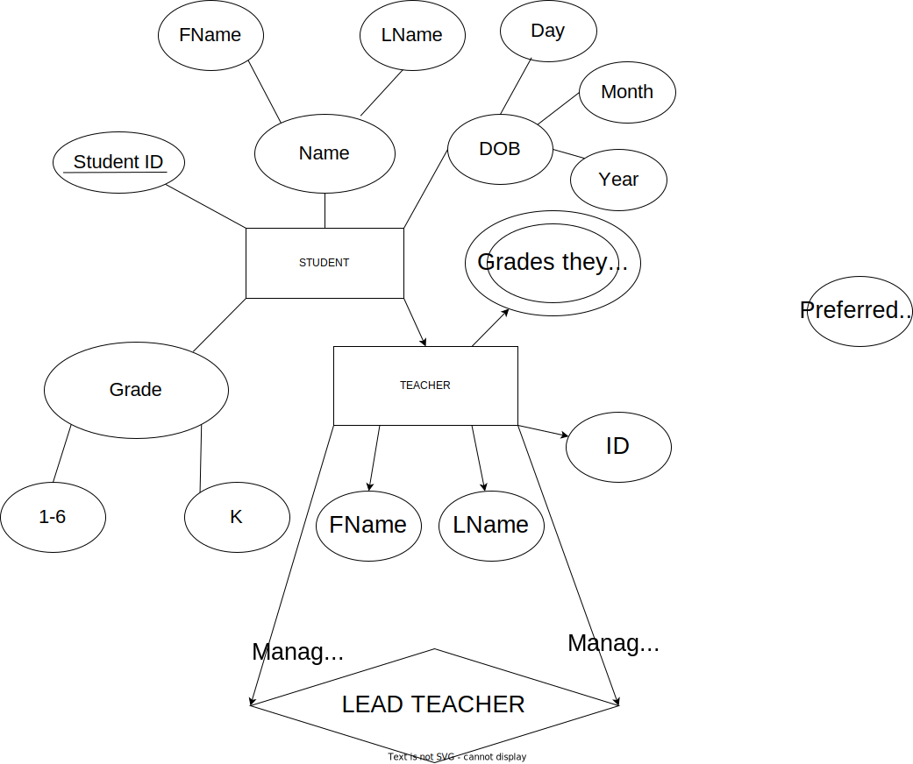

# EER Diagram

## Design Explanation
### Entity type
### Relationship and participating entity types
### Attribute Derivation

## EER Diagram
### Diagram: 

### Explanation

Teacher: The teacher is an entity in our database model with 5 attributes and 2 relationships with other entities.
First name(Fname), Last name(Lname), ID, Preferred prefix and Grades they teach are the attributes of Teacher.
It has ID as its primary key attribute and Grades they teach as a Multivalued attribute.
ID is the primary key attribute because every teacher can have the same first name or last name and preferred prefix; but even if they do, in this situation they will all have uniqiue IDs.
It has Grades they teach because each Teacher could have various grades that they could teach.
It also has a subclass called Lead Teacher.
Each Lead Teacher manages several Teachers.
Teachers also have a relationship with students where they teach them.

Emergency Contact: The teacher is an entity in our database model with 3 attrubutes and 2 relationships with others entitites. 
First name(Fname), Last name(Lname) and Phone number are the attributes of Teacher.
It has its Primary key attribute as Phone number because you would need one phone number to call in time of emergencies.
It has a relationship with parent which shows that parents can be the emergency contact and they would be the ones to be contacted when those times arrive.
It also has a relationship with student where every student must have at least one emergency contact.

Lead Teacher: The Lead Teacher is another entity in our database model.
The Lead Teacher is a subclass of the teacher entity in our database model.
The Lead Teacher has all the attributes and relattionships that the Teacher entity posseses.
The Lead Teacher also has the attribute Managed teachers. This is a multivariable attribute that has a list of the Teachers' IDs that they manage. 
The Lead Teacher also has the unique relationship with the Teacher entity where 1 Lead Teacher manages multiple Teachers.
